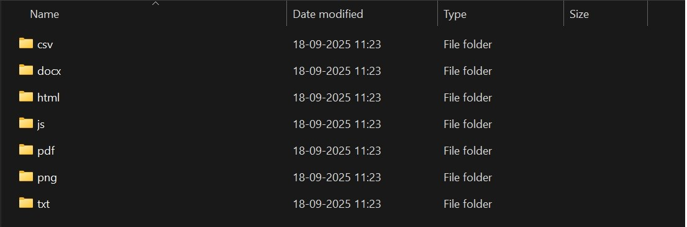

# File Organizer Automation Script

A simple but powerful Python script to automatically organize files in a directory based on their extension. This script helps keep folders like 'Downloads' tidy by moving files into specific subfolders (e.g., all `.pdf` files into a `pdf` folder).

---

## 📸 Screenshot



## ✨ Features

- **Automatic Sorting:** Sorts files into folders named after their file extension.
- **Folder Creation:** Automatically creates new folders for file types it hasn't seen before.
- **User-Friendly:** Prompts the user for the directory path to organize.
- **Safe:** Ignores existing sub-directories and only moves files.

---

## 🛠️ Tech Stack

- **Language:** Python
- **Modules:** `os`, `shutil` (Python Standard Library)

---

## 🚀 How to Use

1.  **Clone the repository:**
    ```bash
    git clone [https://github.com/your-username/FileOrganizer.git](https://github.com/your-username/FileOrganizer.git)
    ```
2.  **Navigate to the directory:**
    ```bash
    cd FileOrganizer
    ```
3.  **Run the script:**
    ```bash
    python organizer.py
    ```
4.  **Enter the path** to the directory you want to clean up when prompted.


